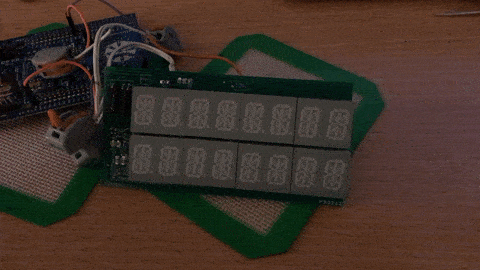

## MAX6955 LED Display Driver

3/20/2020



I started learning Rust a few months ago and quickly fell in love with it. After spending a couple of months reading [the Book](https://doc.rust-lang.org/book/) and doing [Exercism](https://exercism.io) exercises, I dived into the sea of embedded Rust world. Although it seemed pretty difficult to navigate at first, I enjoyed the learning process and managed to write a simple device driver in Rust. 

## max6955 Driver

`max6955` is a device driver to communicate with MAX6955 LED Display Driver through I2C interface. I chose MAX6955 for my first project because if blinking LED is exciting, scrolling text is a hundred times more exciting. I dug through my toy box and found a 8 digits x 2 display that I designed and built many years ago. Back then, I wrote a driver in C. 

Since the device is pretty simple, it didn't take much time to develop the driver in Rust. Of course, I had some difficulties along the way. But, the compiler was nice enough to suggest possible solutions. 

Here is my [max6955 crate](https://crates.io/crates/max6955) and [the Github repo](https://github.com/lonesometraveler/max6955).

And here is a scrolling Text application using `max6955` driver! RUST RUST RUST!

```rust
#![no_std]
#![no_main]

extern crate panic_halt;
pub use cortex_m::{asm::bkpt, iprint, iprintln, peripheral::ITM};
pub use cortex_m_rt::entry;
use f3::hal::gpio::gpiob::{PB6, PB7};
use f3::hal::gpio::AF4;
use f3::hal::stm32f30x::I2C1;
pub use f3::hal::{delay::Delay, prelude};
use f3::hal::{i2c::I2c, prelude::*, stm32f30x};

use max6955::*;
pub type MAX6955 = max6955::Max6955<I2c<I2C1, (PB6<AF4>, PB7<AF4>)>>;

#[entry]
fn main() -> ! {
    let (mut max6955, mut delay) = init();
    max6955.powerup().unwrap();
    max6955.set_global_intensity(4).unwrap();

    let txt = [
        "       R", "      RU", "     RUS", "    RUST", "   RUST", "  RUST", " RUST", "RUST",
        "UST", "ST", "T", "        ",
    ];

    loop {
        for t in txt.iter() {
            max6955.write_str(t).unwrap();
            delay.delay_ms(250_u16);
        }
    }
}

pub fn init() -> (MAX6955, Delay) {
    let cp = cortex_m::Peripherals::take().unwrap();
    let dp = stm32f30x::Peripherals::take().unwrap();

    let mut flash = dp.FLASH.constrain();
    let mut rcc = dp.RCC.constrain();

    let clocks = rcc.cfgr.freeze(&mut flash.acr);

    let mut gpiob = dp.GPIOB.split(&mut rcc.ahb);
    let scl = gpiob.pb6.into_af4(&mut gpiob.moder, &mut gpiob.afrl);
    let sda = gpiob.pb7.into_af4(&mut gpiob.moder, &mut gpiob.afrl);

    let i2c = I2c::i2c1(dp.I2C1, (scl, sda), 400.khz(), clocks, &mut rcc.apb1);

    let max6955 = Max6955::new(i2c).unwrap();

    let delay = Delay::new(cp.SYST, clocks);

    (max6955, delay)
}
```


## What I have learned

### "I can do this!"

First of all, embedded Rust is not that bad! Since the community has already figured out the most difficult parts like HAL, I basically read the [datasheet](https://datasheets.maximintegrated.com/en/ds/MAX6955.pdf) and translated registers and expected values to `enum`s and worked on high level APIs like `powerup()`, `set_global_intensity()` and `write_str()`. 

### enum

`enum` seems really powerful in Rust. I guess I only scratched its surface with this project. But, I am already liking it.

Here is how I handled the register map in C many years ago.

```c
#define reg_noOp 0x00
#define reg_decodeMode 0x01
#define reg_globalIntensity 0x02
#define reg_scanLimit 0x03
#define reg_configuration 0x04
...
```
And in Rust this time.

```rust
pub enum Register {
    NoOp = 0x00,
    DecodeMode = 0x01,
    GlobalIntensity = 0x02,
    ScanLimit = 0x03,
    Configuration = 0x04,
    ...
}

impl Register {
    /// return register address as u8
    pub fn addr(self) -> u8 {
        self as u8
    }
}
```
Rust's type system makes sure that I don't pass a wrong value and refuses to compile if I pass a different `enum` or `u8`.

### Trait

`Trait` is pretty cool too. This driver can take whatever I2C instance that implements `WriteRead` and `Write`. Below is how I construct a driver with an instance of `I2C`.

```rust
impl<I2C, E> Max6955<I2C>
where
    I2C: WriteRead<Error = E> + Write<Error = E>,
{
    pub fn new(i2c: I2C) -> Result<Self, E> {
        let max6955 = Max6955 {
            i2c,
            addr: DEFAULT_SLAVE_ADDR,
        };
        Ok(max6955)
    }
}
```
`I2C` is generic here. The method expects something that implements `WriteRead` and `Write`. I tested this driver with `stm32f30x-hal` and `stm32f3xx_hal` and it worked with both as expected! I think I can even make a fake interface with `WriteRead` and `Write` for unit testing. I will explore that in future projects.

### Documentation

Lastly, I found Rust's built-in documentation feature fantastic. I think it really encourages developers to document. It is really nice to generate documentation without external tools. 

## Final Thoughts

I am still an infant Rustacean just starting to explore the language and its ecosystem. But, I have a strong intuitive feeling that Rust is great for embedded systems. I really think that Rust’s type system and zero cost abstractions help me write safe and clean readable code without sacrificing performance.

